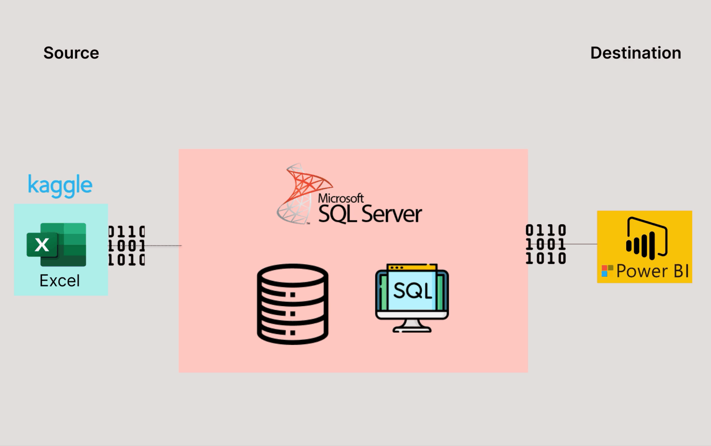
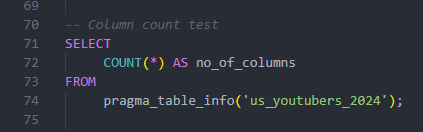
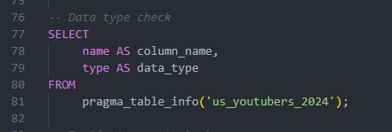
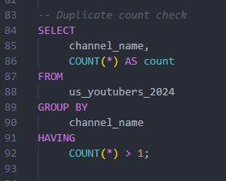
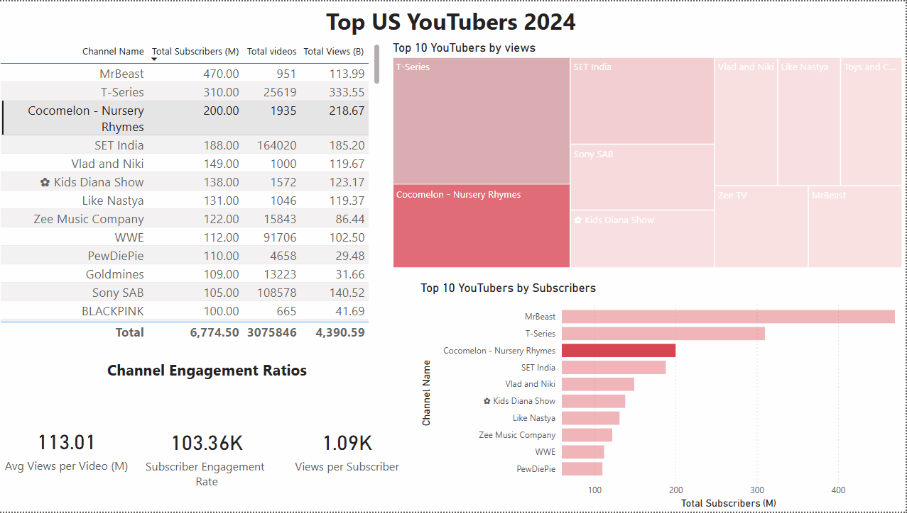

# Data Portfolio: Excel to Power BI 





# Table of contents 

- [Objective](#objective)
- [Data Source](#data-source)
- [Stages](#stages)
- [Design](#design)
  - [Mockup](#mockup)
  - [Tools](#tools)
- [Development](#development)
  - [Pseudocode](#pseudocode)
  - [Data Exploration](#data-exploration)
  - [Data Cleaning](#data-cleaning)
  - [Transform the Data](#transform-the-data)
  - [Create the SQL View](#create-the-sql-view)
- [Testing](#testing)
  - [Data Quality Tests](#data-quality-tests)
- [Visualization](#visualization)
  - [Results](#results)
  - [DAX Measures](#dax-measures)
- [Analysis](#analysis)
  - [Findings](#findings)
  - [Validation](#validation)
  - [Discovery](#discovery)
- [Recommendations](#recommendations)
  - [Potential ROI](#potential-roi)
  - [Potential Courses of Actions](#potential-courses-of-actions)
- [Conclusion](#conclusion)


# Objective 

- What is the key pain point? 

The Head of Marketing wants to find out who the top YouTubers in the USA are in 2024 to decide on which YouTubers would be best to run marketing campaigns throughout the rest of the year.


- What is the ideal solution? 

To create a dashboard that provides insights into the top US YouTubers in 2024 that includes their 
- subscriber count
- total views
- total videos, and
- engagement metrics

This will help the marketing team make informed decisions about which YouTubers to collaborate with for their marketing campaigns.

## User story 

As the Head of Marketing, I want to use a dashboard that analyses YouTube channel data in the US . 

This dashboard should allow me to identify the top performing channels based on metrics like subscriber base and average views. 

With this information, I can make more informed decisions about which Youtubers are right to collaborate with, and therefore maximize how effective each marketing campaign is.


# Data source 

- What data is needed to achieve our objective?

We need data on the top US YouTubers in 2024 that includes their 
- channel names
- total subscribers
- total views
- total videos uploaded


- Where is the data coming from? 
The data is sourced from Kaggle (an Excel extract), [see here to find it.](https://www.kaggle.com/datasets/bhavyadhingra00020/top-100-social-media-influencers-2024-countrywise?resource=download)


# Stages

- Design
- Developement
- Testing
- Analysis 
 


# Design 

## Dashboard components required 
- What should the dashboard contain based on the requirements provided?

To understand what it should contain, we need to figure out what questions we need the dashboard to answer:

1. Who are the top 10 YouTubers with the most subscribers?
2. Which 3 channels have uploaded the most videos?
3. Which 3 channels have the most views?
4. Which 3 channels have the highest average views per video?
5. Which 3 channels have the highest views per subscriber ratio?
6. Which 3 channels have the highest subscriber engagement rate per video uploaded?

For now, these are some of the questions we need to answer, this may change as we progress down our analysis. 


## Dashboard mockup

- What should it look like? 

Some of the data visuals that may be appropriate in answering our questions include:

1. Table
2. Treemap
3. Scorecards
4. Horizontal bar chart 

***[The initial design of the dashboard wireframe was done with Mokkup.ai]([https://www.mokkup.ai/)***


## Tools 


| Tool | Purpose |
| --- | --- |
| Excel | Exploring the data |
| Vs Code | IDE in cleaning, testing, and analyzing the data |
| SQLite | the database used to host the data |
| Power BI | Visualizing the data via interactive dashboards |
| GitHub | Hosting the project documentation and version control |
| Mokkup AI | Designing the wireframe/mockup of the dashboard | 


# Development

## Pseudocode

- What's the general approach in creating this solution from start to finish?

1. Get the data
2. Explore the data in Excel
3. Load the data into SQLite in Vscode
4. Clean the data with SQL
5. Test the data with SQL
6. Visualize the data in Power BI
7. Generate the findings based on the insights
8. Write the documentation + commentary
9. Publish the data to GitHub Pages

## Data exploration notes

This is the stage where you have a scan of what's in the data, errors, inconcsistencies, bugs, weird and corrupted characters etc  


- What are your initial observations with this dataset? What's caught your attention so far? 

1. There are at least 4 columns that contain the data we need for this analysis, which signals we have everything we need from the file without needing to contact the client for any more data. 
2. The first column contains the channel ID with what appears to be channel IDS, which are separated by a @ symbol - we need to extract the channel names from this.
3. Some of the cells and header names are in a different language - we need to confirm if these columns are needed, and if so, we need to address them.
4. We have more data than we need, so some of these columns would need to be removed


## Data cleaning 
- What do we expect the clean data to look like? (What should it contain? What contraints should we apply to it?)

The aim is to refine our dataset to ensure it is structured and ready for analysis. 

The cleaned data should meet the following criteria and constraints:

- Only relevant columns should be retained.
- All data types should be appropriate for the contents of each column.
- No column should contain null values, indicating complete data for all records.

Below is a table outlining the constraints on our cleaned dataset:

| Property | Description |
| --- | --- |
| Number of Rows | 100 |
| Number of Columns | 4 |

And here is a tabular representation of the expected schema for the clean data:

| Column Name | Data Type | Nullable |
| --- | --- | --- |
| channel_name | VARCHAR | NO |
| total_subscribers | INTEGER | NO |
| total_views | INTEGER | NO |
| total_videos | INTEGER | NO |


- What steps are needed to clean and shape the data into the desired format?

1. Remove unnecessary columns by only selecting the ones you need
2. Extract Youtube channel names from the first column
3. Rename columns using aliases


### Transform the data 


```sql
/*
Data cleaning steps

1. Remove unncessary columns by only slecting the ones we need
2. Extract the YouTube channel names from the first column.
3. Rename the column names. 
*/

SELECT 
    NAME,
    total_subscribers,
    total_views,
    total_videos
FROM
    us_channels
```


### Create the SQL view 

```sql
/*
# 1. Create a view to store the transformed data
# 2. Cast the extracted channel name as VARCHAR(100)
# 3. Select the required columns from the top_us_youtubers_2024 SQL table 
*/

-- 1.
CREATE VIEW us_youtubers_2024 AS

-- 2.
SELECT
    CAST(SUBSTR(NAME, 1, INSTR(NAME, '@') - 1) AS VARCHAR(100)) AS channel_name,
    total_subscribers,
    total_views,
    total_videos

-- 3.
FROM
    us_channels

```


# Testing 

- What data quality and validation checks are you going to create?

Here are the data quality tests conducted:

## Row count check
```sql
/*
# Count the total number of records (or rows) are in the SQL view
*/

SELECT 
    COUNT(*) AS no_of_rows
FROM
     us_youtubers_2024;

```


## Column count check
### SQL query 
```sql
/*
# Count the total number of columns (or fields) are in the SQL view
*/

SELECT
     COUNT(*) AS no_of_columns
FROM
     pragma_table_info('us_youtubers_2024');
```
### Output 



## Data type check
### SQL query 
```sql
/*
# Check the data types of each column from the view by checking the INFORMATION SCHEMA view
*/

-- 1.
SELECT
     name AS column_name,
     type AS data_type
FROM
     pragma_table_info('us_youtubers_2024');
```
### Output



## Duplicate count check
### SQL query 
```sql
/*
# 1. Check for duplicate rows in the view
# 2. Group by the channel name
# 3. Filter for groups with more than one row
*/

-- 1.
SELECT
     channel_name,
     COUNT(*) AS count
FROM
     us_youtubers_2024

-- 2.
GROUP BY
     channel_name

-- 3.
HAVING
     COUNT(*) > 1;
```
### Output


# Visualization 


## Results

- What does the dashboard look like?



This shows the Top US Youtubers in 2024 so far. 


## DAX Measures

### 1. Total Subscribers (M)
```sql
Total Subscribers (M) = 
VAR million = 1000000
VAR sumOfSubscribers = SUM(view_us_youtubers_2024[total_subscribers])
VAR totalSubscribers = DIVIDE(sumOfSubscribers,million)

RETURN totalSubscribers

```

### 2. Total Views (B)
```sql
Total Views (B) = 
VAR billion = 1000000000
VAR sumOfTotalViews = SUM(view_us_youtubers_2024[total_views])
VAR totalViews = ROUND(sumOfTotalViews / billion, 2)

RETURN totalViews

```

### 3. Total Videos
```sql
Total Videos = 
VAR totalVideos = SUM(view_us_youtubers_2024[total_videos])

RETURN totalVideos

```

### 4. Average Views Per Video (M)
```sql
Average Views per Video (M) = 
VAR sumOfTotalViews = SUM(view_us_youtubers_2024[total_views])
VAR sumOfTotalVideos = SUM(view_us_youtubers_2024[total_videos])
VAR  avgViewsPerVideo = DIVIDE(sumOfTotalViews,sumOfTotalVideos, BLANK())
VAR finalAvgViewsPerVideo = DIVIDE(avgViewsPerVideo, 1000000, BLANK())

RETURN finalAvgViewsPerVideo 

```


### 5. Subscriber Engagement Rate
```sql
Subscriber Engagement Rate = 
VAR sumOfTotalSubscribers = SUM(view_us_youtubers_2024[total_subscribers])
VAR sumOfTotalVideos = SUM(view_us_youtubers_2024[total_videos])
VAR subscriberEngRate = DIVIDE(sumOfTotalSubscribers, sumOfTotalVideos, BLANK())

RETURN subscriberEngRate 

```


### 6. Views per subscriber
```sql
Views Per Subscriber = 
VAR sumOfTotalViews = SUM(view_us_youtubers_2024[total_views])
VAR sumOfTotalSubscribers = SUM(view_us_youtubers_2024[total_subscribers])
VAR viewsPerSubscriber = DIVIDE(sumOfTotalViews, sumOfTotalSubscribers, BLANK())

RETURN viewsPerSubscriber 

```


# Analysis 

## Findings

- What did we find?

For this analysis, we're going to focus on the questions below to get the information we need for our marketing client - 

Here are the key questions we need to answer for our marketing client: 
1. Who are the top 10 YouTubers with the most subscribers?
2. Which 3 channels have uploaded the most videos?
3. Which 3 channels have the most views?
4. Which 3 channels have the highest average views per video?
5. Which 3 channels have the highest views per subscriber ratio?
6. Which 3 channels have the highest subscriber engagement rate per video uploaded?


### 1. Who are the top 10 YouTubers with the most subscribers?

| Rank | Channel Name         | Subscribers (M) |
|------|----------------------|-----------------|
| 1    | MrBeast			  | 470.0           |
| 2    | T-series             | 310.0           |
| 3    | Cocomelon-Nursery    | 200.0           |
| 4    | SET India            | 188.0           |
| 5    | Vlad & Niki          | 149.0           |
| 6    | Kids Diana Show      | 138.0           |
| 7    | Like Nastya          | 131.0           |
| 8    | Zee Music            | 122.0           |
| 9    | WWE                  | 112.0           |
| 10   | pweDiePie            | 110.0           |


### 2. Which 3 channels have uploaded the most videos?

| Rank | Channel Name    | Videos Uploaded |
|------|-----------------|-----------------|
| 1    | Aaj Tak      	 | 610,121         |
| 2    | ABP News 		 | 548,576         |
| 3    | TEDx Talks      | 256,179         |


### 3. Which 3 channels have the most views?


| Rank | Channel Name | Total Views (B) |
|------|--------------|-----------------|
| 1    | T-Series     | 333.55          |
| 2    | Cocomelon Nur| 218.67          |
| 3    | SET India    | 185.20          |


### 4. Which 3 channels have the highest average views per video?

| Channel Name | Averge Views per Video (M) |
|--------------|-----------------|
| Bad Bunny    | 241.73          |
| Bruno Mars   | 207.69          |
| EminemMusic  | 175.18          |


### 5. Which 3 channels have the highest views per subscriber ratio?

| Rank | Channel Name       | Views per Subscriber        |
|------|-----------------   |---------------------------- |
| 1    | Ryan's World       | 1,571.69                    |
| 2    | Toys and Colors    | 1,416.29                    |
| 3    | Sony SAB           | 1,338.25                    |


### 6. Which 3 channels have the highest subscriber engagement rate per video uploaded?

| Rank | Channel Name    | Subscriber Engagement Rate  |
|------|-----------------|---------------------------- |
| 1    | Mrbeast         | 494,216.61                  |
| 2    | Bruno Mars      | 360,000.00                  |
| 3    | Billie Eilish   | 317,582.42                  |


### Notes

For this analysis, we'll prioritize analysing the metrics that are important in generating the expected ROI for our marketing client, which are the YouTube channels wuth the most 

- subscribers
- total views
- videos uploaded


## Validation 

### 1. Youtubers with the most subscribers 

#### Calculation breakdown

Campaign idea = product placement 

1. MrBeast 
- Average views per video = 119.86 million
- Product cost = $5
- Potential units sold per video = 119.86 million x 2% conversion rate = 2,397,200 units sold
- Potential revenue per video = 2,397,200 x $5 = $11,986,000
- Campaign cost (one-time fee) = $1,500,000
- **Net profit = $11,986,000 - $1,500,000 = $10,486,000**

b. T-series

- Average views per video = 13.02 million
- Product cost = $5
- Potential units sold per video = 13.02 million x 2% conversion rate = 260,400 units sold
- Potential revenue per video = 260,400 x $5 = $1,302,000
- Campaign cost (one-time fee) = $1,500,000
- **Net profit/(loss) = $1,302,000 - $1,500,000 = ($198,000)**

c. Cocomelon - Nursery Rhymes

- Average views per video = 113.01 million
- Product cost = $5
- Potential units sold per video = 113.01 million x 2% conversion rate = 2,260,200 units sold
- Potential revenue per video = 2,260,200 x $5 = $11,301,000
- Campaign cost (one-time fee) = $1,500,000
- **Net profit = $1,115,000 - $1,500,000 = $9,801,000**


Best option from category: Mr Beast


#### SQL query 

```sql
/* 

# 1. Define variables 
# 2. Create a CTE that rounds the average views per video 
# 3. Select the column you need and create calculated columns from existing ones 
# 4. Filter results by Youtube channels
# 5. Sort results by net profits (from highest to lowest)

*/


-- 1. 
-- 1. Variables are inlined as literals (SQLite does not support DECLARE)
-- conversationRate = 0.02   (2% conversion rate)
-- productCost      = 5.00   ($5.00 product cost)
-- campaignCost     = 1500000.00  ($1,500,000 campaign cost)


-- 2.  
WITH ChannelData AS (
    SELECT
        channel_name,
        total_views,
        total_videos,
        ROUND((CAST(total_views AS REAL) / total_videos), -4) AS avg_views_per_video
    FROM
        us_youtubers_2024
    )

-- 3. 
SELECT
    channel_name,
    avg_views_per_video,
    ROUND(avg_views_per_video * 0.02, -4) AS potential_units_sold_per_video,
    ROUND(avg_views_per_video * 0.02 * 5.00, -4) AS potential_revenue_per_video,
    ROUND((avg_views_per_video * 0.02 * 5.00) - 1500000.00, -4) AS net_profit_per_video
FROM
    ChannelData


-- 4. 
WHERE 
    channel_name IN ('MrBeast', 'T-Series', 'Cocomelon - Nursery Rhymes')   


-- 5.  
ORDER BY 
    net_profit_per_video DESC;

```

#### Output


### 2. Youtubers with the most videos uploaded

### Calculation breakdown 

Campaign idea = sponsored video series  

1. **Aaj Tak**
- Average views per video = 70,000
- Product cost = $5
- Potential units sold per video = 70,000 x 2% conversion rate = 1,400 units sold
- Potential revenue per video = 1,400 x $5= $7,000
- Campaign cost (11-videos @ $141K each) = $1,550,000
- **Net profit (loss) = $7,000 - $1,550,000 = -$1,543,000 (potential loss)**

b. **ABP News**

- Average views per video = 50,000
- Product cost = $5
- Potential units sold per video = 50,000 x 2% conversion rate = 1,000 units sold
- Potential revenue per video = 1,000 x $5= $5,000
- Campaign cost (11-videos @ $141K each) = $1,550,000
- **Net profit (loss) = $1,550,000 - $5,000 = -$1,545,000 (potential loss)**

b. **Yogscast**

- Average views per video = 30,000
- Product cost = $5
- Potential units sold per video = 30,000 x 2% conversion rate = 600 units sold
- Potential revenue per video = 600 x $5= $3,000
- Campaign cost (11-videos @ $141K each) = $1,550,000
- **Net profit (loss) = $71,000 - $1,550,000 = -$11,547,000 (potential loss)**


Best option from category: None

#### SQL query 
```sql
/*
if using SQL Server
# 1. Define variables
# 2. Create a CTE that rounds the average views per video
# 3. Select the columns you need and create calculated columns from existing ones
# 4. Filter results by YouTube channels
# 5. Sort results by net profits (from highest to lowest)
*/


-- 1.
DECLARE @conversionRate FLOAT = 0.02;           	-- The conversion rate @ 2%
DECLARE @productCost FLOAT = 5.0;               	-- The product cost @ $5
DECLARE @campaignCostPerVideo FLOAT = 1,550,000.0;	-- The campaign cost per video @ $141k
DECLARE @numberOfVideos INT = 11;               	-- The number of videos (11)


-- 2.
WITH ChannelData AS (
    SELECT
        channel_name,
        total_views,
        total_videos,
        ROUND((CAST(total_views AS FLOAT) / total_videos), -4) AS rounded_avg_views_per_video
    FROM
        us_youtubers_2024
)


-- 3.
SELECT
    channel_name,
    rounded_avg_views_per_video,
    (rounded_avg_views_per_video * @conversionRate) AS potential_units_sold_per_video,
    (rounded_avg_views_per_video * @conversionRate * @productCost) AS potential_revenue_per_video,
    ((rounded_avg_views_per_video * @conversionRate * @productCost) - (@campaignCostPerVideo * @numberOfVideos)) AS net_profit
FROM
    ChannelData


-- 4.
WHERE
    channel_name IN ('Aaj', 'ABP NEWS', 'TEDx Talks ')


-- 5.
ORDER BY
    net_profit DESC;
```

#### Output


### 3.  Youtubers with the most views 

#### Calculation breakdown

Campaign idea = Influencer marketing 

a. T-Series

- Average views per video = 13.01 million
- Product cost = $5
- Potential units sold per video = 13.02 million x 2% conversion rate = 260,400 units sold
- Potential revenue per video = 260,400 x $5 = $1,302,000
- Campaign cost (8-month contract) = $500,000
- **Net profit = $1,302,000 - $500,000 = $802,000**

b. Cocomelon

- Average views per video = 113.01 million
- Product cost = $5
- Potential units sold per video = 113.01 million x 2% conversion rate = 2,260,200 units sold
- Potential revenue per video = 2,260,200 x $5 = $11,301,000
- Campaign cost (8-month contract) = $500,000
- **Net profit = $11,301,000 - $500,000 = $10,801,000**

c. SET India

- Average views per video = 1.13 million
- Product cost = $5
- Potential units sold per video = 1.13 million x 2% conversion rate = 22,600 units sold
- Potential revenue per video = 22,600 x $5 = $113,000
- Campaign cost (8-month contract) = $500,000
- **Net profit = $113,000 - $500,000 = -$387,000 (potential losses)**

Best option from category: Cocomelon


#### SQL query 
```sql
/*
# 1. Define variables
# 2. Create a CTE that rounds the average views per video
# 3. Select the columns you need and create calculated columns from existing ones
# 4. Filter results by YouTube channels
# 5. Sort results by net profits (from highest to lowest)
*/


-- 1.
DECLARE @conversionRate FLOAT = 0.02;        -- The conversion rate @ 2%
DECLARE @productCost MONEY = 5.0;            -- The product cost @ $5
DECLARE @campaignCost MONEY = 500000.0;      -- The campaign cost @ $500,000


-- 2.
WITH ChannelData AS (
    SELECT
        channel_name,
        total_views,
        total_videos,
        ROUND(CAST(total_views AS FLOAT) / total_videos, -4) AS avg_views_per_video
    FROM
        us_youtubers_2024
)


-- 3.
SELECT
    channel_name,
    avg_views_per_video,
    (avg_views_per_video * @conversionRate) AS potential_units_sold_per_video,
    (avg_views_per_video * @conversionRate * @productCost) AS potential_revenue_per_video,
    (avg_views_per_video * @conversionRate * @productCost) - @campaignCost AS net_profit
FROM
    ChannelData


-- 4.
WHERE
    channel_name IN ('T-Series', 'Cocomelon Nursery-Rhymes', 'SET India')


-- 5.
ORDER BY
    net_profit DESC;

```

#### Output


## Discovery

- What did we learn?

We discovered that 


1. Mr Beast, T-Series and Cocomelon-Nursery Rhymes are the channnels with the most subscribers in the US
2. Aaj Tak, ABP NEWS and TEDx Talks are the channels with the most videos uploaded
3. T-Series, Cocomelon-Nursey-Rhymes and SET India are the channels with the most views
4. Entertainment channels are useful for broader reach, as the channels posting consistently on their platforms and generating the most engagement are focus on entertainment and drama 


## Recommendations 

- What do you recommend based on the insights gathered? 
  
1. Mr Beast is the best YouTube channel to collaborate with if we want to maximize visbility because this channel has the most YouTube subscribers in the US
2. Although Aaj Tak, ABP News and TEDx Talks are regular publishers on YouTube, it may be worth considering whether collaborating with them with the current budget caps are worth the effort, as the potential return on investments is significantly lower compared to the other channels.
3. Cocomelon-Nursey Rhymes is the best YouTube platform to collaborate with if we're interested in maximizing reach, but collaborating with T-Series and SET India may be better long-term options considering the fact that they both have large subscriber bases and are averaging significantly high number of views.
4. The top 2 channels to form collaborations with are Mr Beast and Cocomelon-Nursery Rhymes based on this analysis, because they attract the most engagement on their channels consistently.
5. We may have to tweak our advertisement through the Cocomelon platform to fit younger kids and ensure that our advertisement via that channel is appropriate for the target audience on that platform.


### Potential ROI 
- What ROI do we expect if we take this course of action?

1. Setting up a collaboration deal with MrBeast would make the client a net profit of $10,486,000
2. An marketing contract with Cocomelon-Nursey Rhymes can see the client generate a net profit of $11,301,000


### Action plan
- What course of action should we take and why?

Based on our analysis, we beieve the best channel to advance a long-term partnership deal with to promote the client's products is the Mr Beast channel. 

We'll have conversations with the marketing client to forecast what they also expect from this collaboration. Once we observe we're hitting the expected milestones, we'll advance with potential partnerships with Cocomelon Nursery-Rhymes, T-series and SET India channels in the future.   

- What steps do we take to implement the recommended decisions effectively?


1. Reach out to the teams behind each of these channels, starting with Mr Beast
2. Negotiate contracts within the budgets allocated to each marketing campaign
3. Kick off the campaigns and track each of their performances against the KPIs
4. Review how the campaigns have gone, gather insights and optimize based on feedback from converted customers and each channel's audiences 


